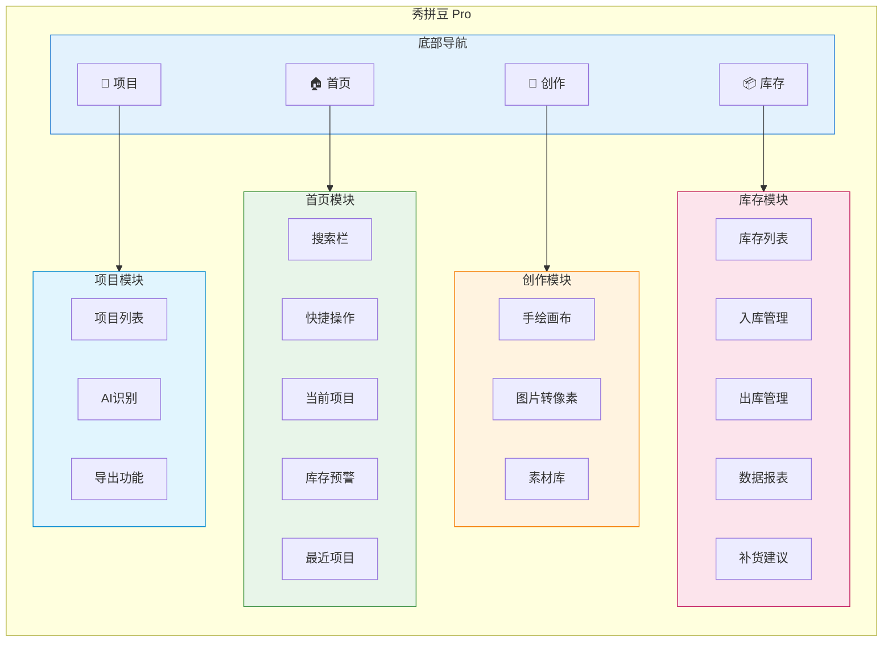
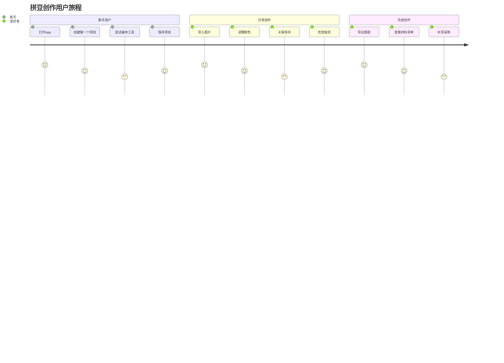
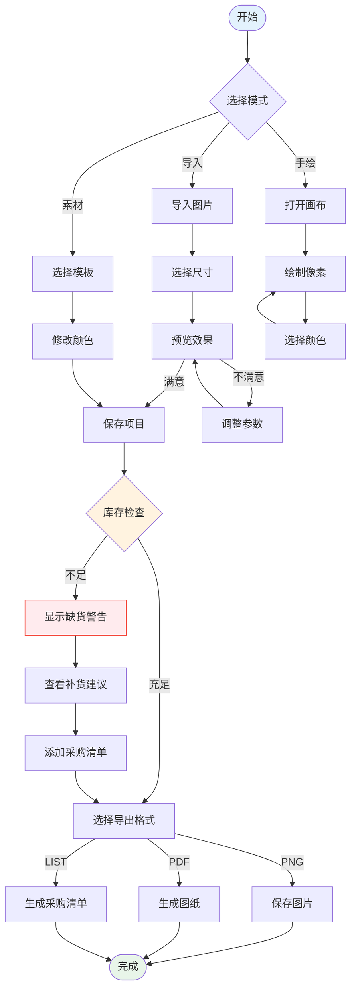
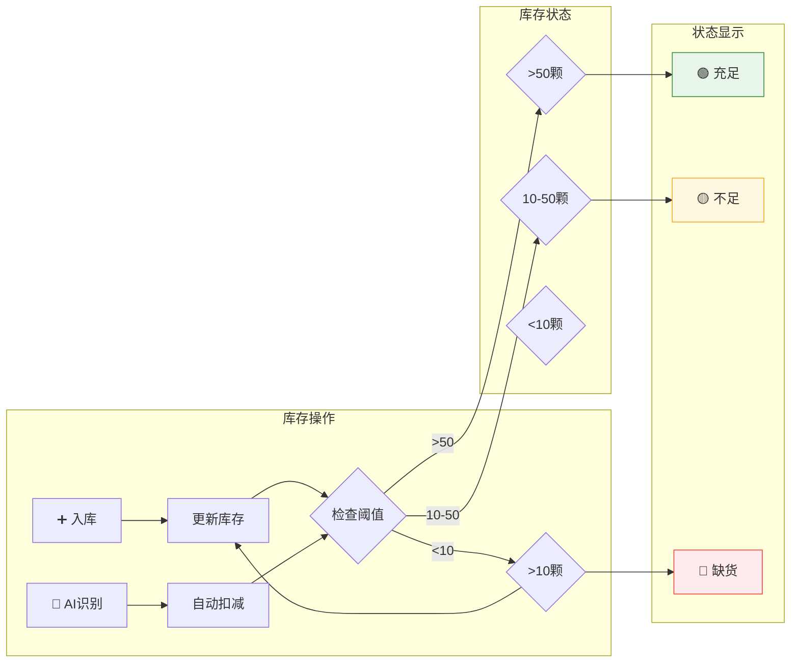
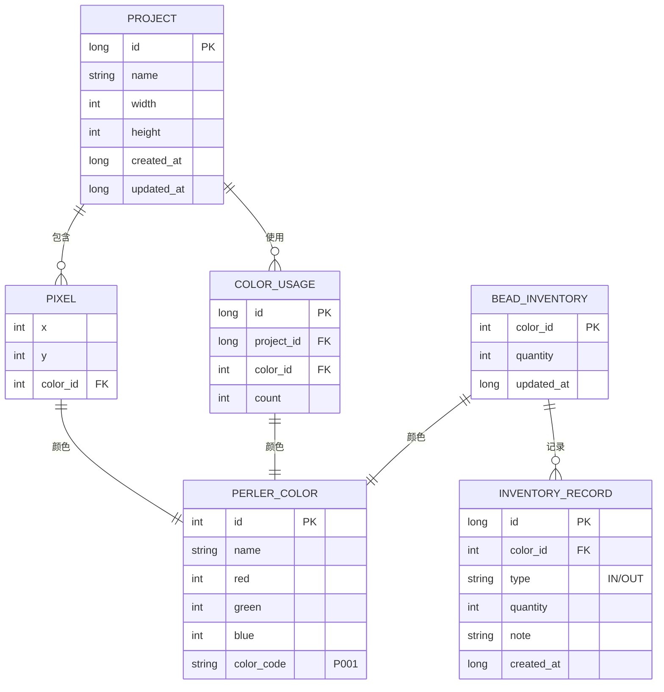
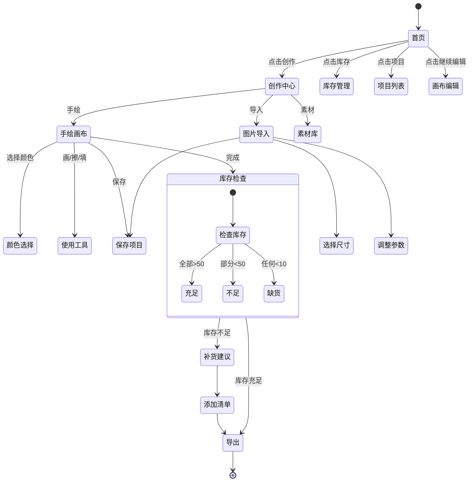
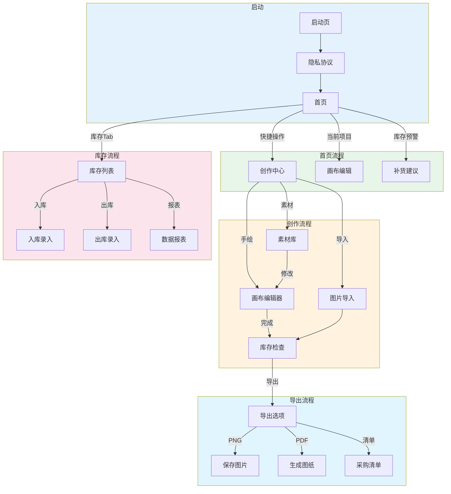
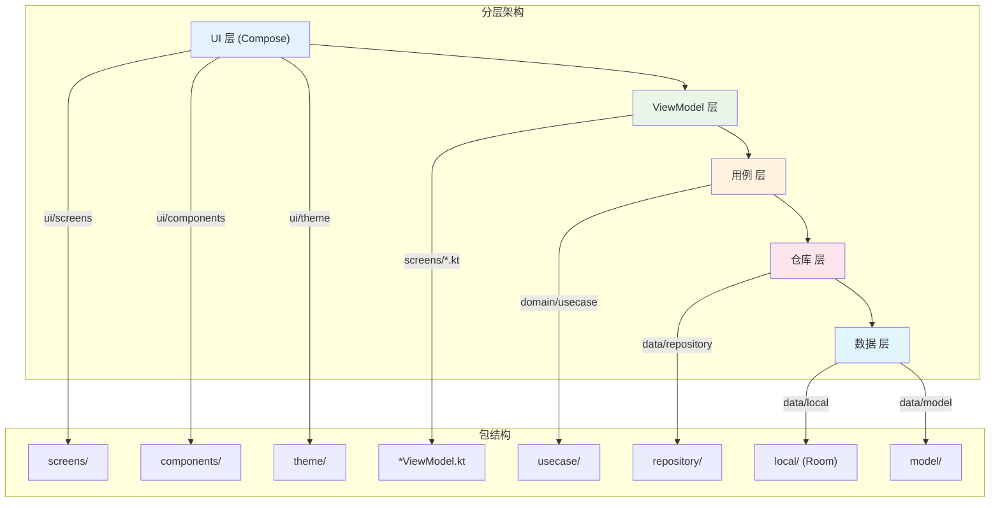
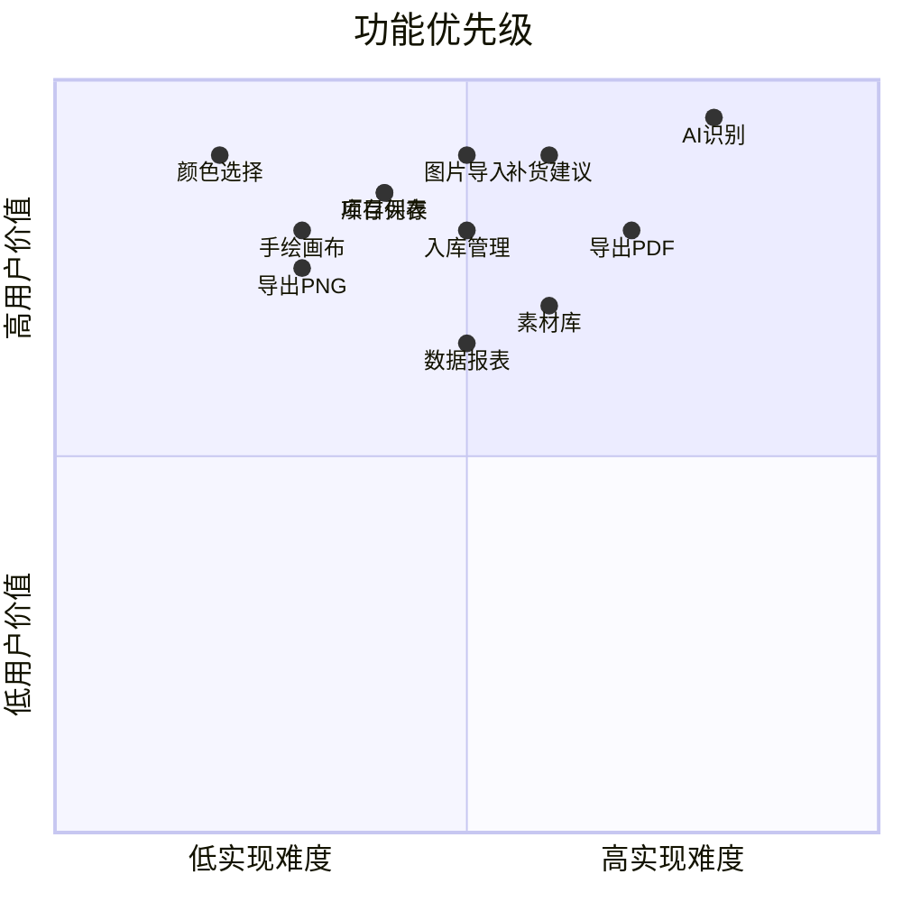

# 秀拼豆 Pro - 流程图与架构图

> Mermaid 格式图表

---

## 1. App 整体架构

---

## 2. 用户旅程

---

## 3. 创作流程

---

## 4. 库存管理流程

---

## 5. 数据模型关系

---

## 6. 状态机

---

## 7. 屏幕流程

---

## 8. 模块依赖

---

## 9. 功能优先级矩阵

---

*图表将根据项目迭代持续更新*
